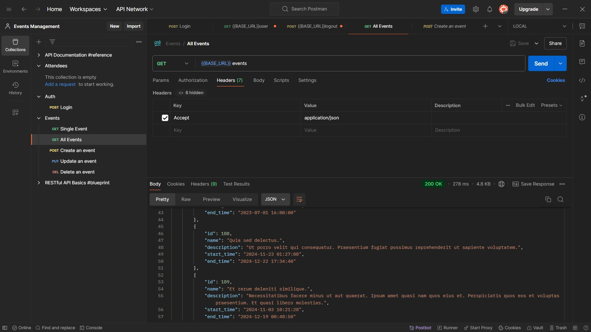
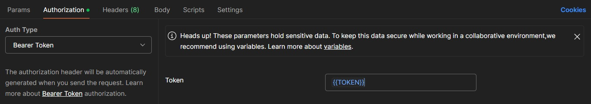
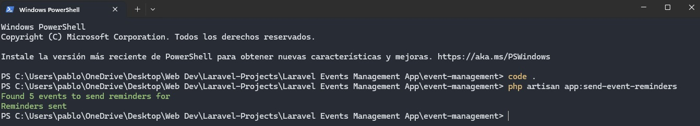
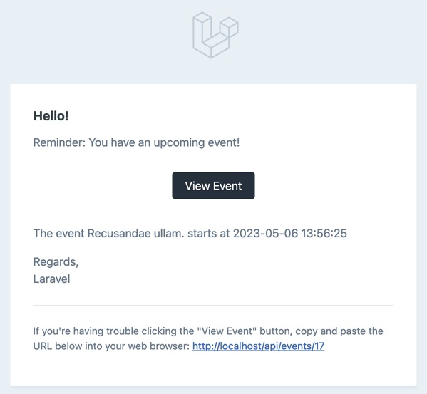

# Pablo Paez 🦝 - LARAVEL - TASK LIST 💻

 

  

# El Proyecto⭐ / The Project🌟
### Postman interacions:

  

### Users Mail interacions:

  

⭐ El proyecto es parte del portfolio de proyectos de LARAVEL, en esto caso una aplicacion donde se maneja el uso de Eventos/Fiestas por medio de esta RESTful API, se enviaran mails a los invitados 24 horas antes de que se lleve a cabo el evento, tambien cada usuario que sea creador de un evento editar detalles del evento creado y ver quienes son las personas que iran al mismo. Esto solo se podra hacer si el usuario es dueño de SU EVENTO, por lo tanto no podra editar eventos de otras personas
El proyecto es parte del portfolio de proyectos de LARAVEL, en esto caso una aplicacion de Tast Lists donde se llevara un registro de las actividades por hacer, las ya hechas, y creacion y eliminacion de las mismas
 
🌟 This project is part of the LARAVEL project portfolio. It is an event management application built on a RESTful API. It will send email invitations to guests 24 hours prior to the event. Users who create events can edit event details and view the guest list. Access to these features is restricted to the event creator

### Tecnologias utilizadas: / Technologies used:

PHP - LARAVEL - TAILWIND / SQL - DOCKER DESKTOP

Tambien se usaron conocimientos en: / Furthermore, expertise in this technologies was utilized: 

    - RESTFULL API DEVELOPMENT
    - API RESOURSES FOR RESPONSE FORMATTING
    - AUTHENTICATION WITH LARAVEL SANCTUM
    - AUTHORIZATION USING GATES AND POLICIES
    - TASK SCHEDULING AND QUEUES
    - NOTIFICATIONS AND EMAIL SENDING

<!-- LINKS -->
### Contacto📩 / Contact📩

Pablo Paez - Desarrollador Web - pablopaez2307@gmail.com

[![LinkedIn][linkedin-shield]][linkedin-url]

[linkedin-shield]: https://img.shields.io/badge/-LinkedIn-black.svg?style=for-the-badge&logo=linkedin&colorB=555
[linkedin-url]: https://www.linkedin.com/in/pablo-paez-t/
